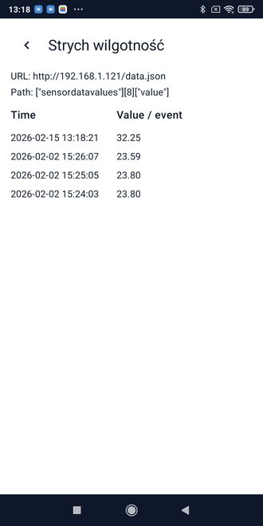
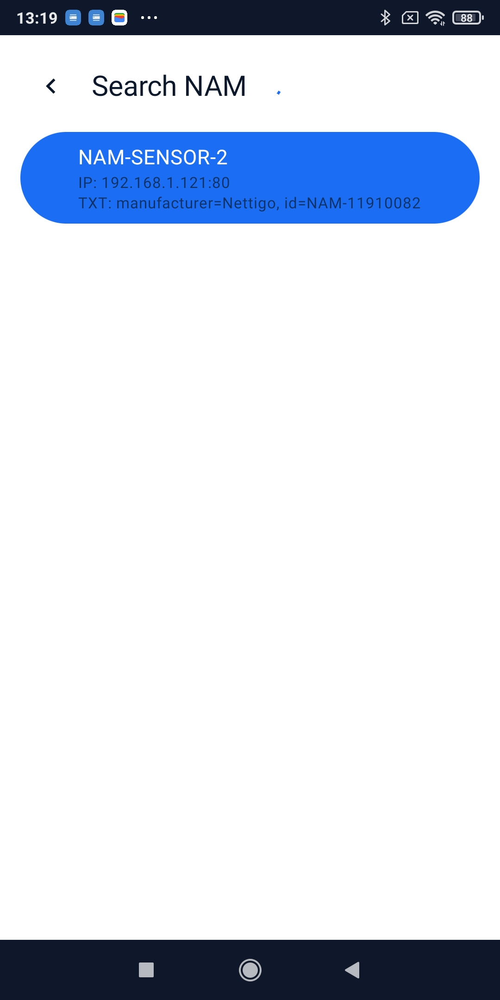
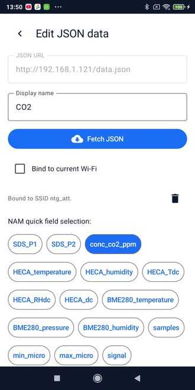
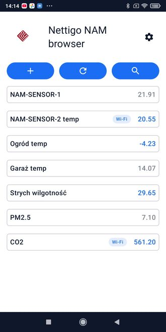

# Nettigo NAM browser

[English version below](#english-version)

Lekka aplikacja Android do przeglądania danych JSON z urządzeń (m.in. NAM). Umożliwia
zapisywanie wybranych wartości, szybkie odświeżanie oraz podgląd historii pomiarów.
Dodatkowo pozwala wyszukiwać urządzenia NAM w sieci lokalnej i szybko tworzyć wpisy. Wymagana
wersja SDK 29 (Android 10)

## Zrzuty ekranu

1. Historia pomiarów pojedynczej wartości:
   
   

2. Wyszukiwanie urządzeń NAM w sieci lokalnej:
   
   

3. Ekran edycji wpisu:
   
   

4. Przykładowy ekran główny:
   
   
   
To repozytorium na razie zawiera same pliku binarne (APK) Nettigo NAM browser.

Piszemy tą aplikację ze wsparciem sił zewnętrznych. Nie przeglądamy szczegółowo kodu, więc jest
dostarczana 'w stanie jakim jest' - bez żadnych gwarancji poprawnego działania. Nie isntaluj jej na urządzeniach z krytycznymi funkcjami.

By zainstalować - ściągnij wybraną  wersję na telefon i zainstaluj ręcznie plik z aplikacji _Pliki_. Wcześniej musisz jej dać do tego uprawnienia.

---

## English version

Lightweight Android app for browsing JSON data from devices (including NAM). It lets you
save selected values, refresh them quickly, and view measurement history. It also supports
discovering NAM devices on the local network and creating entries fast. Minimal SDK version 29 (Android 10)

## Screenshots

1. Measurement history for a single value:
   
   

2. Searching for NAM devices on the local network:
   
   

3. Entry edit screen:
   
   

4. Example home screen:
   
   

This repository is with apk for application Nettigo NAM browser.

We develop it with external help. We don't examine source code thoroughly
and while is quite simple app it is delivered 'as is'. Install it on Android
devices not having critical data/used in critical functions.

Download APK file on phone, enable install of extenal apps and install it
via File Manager.
